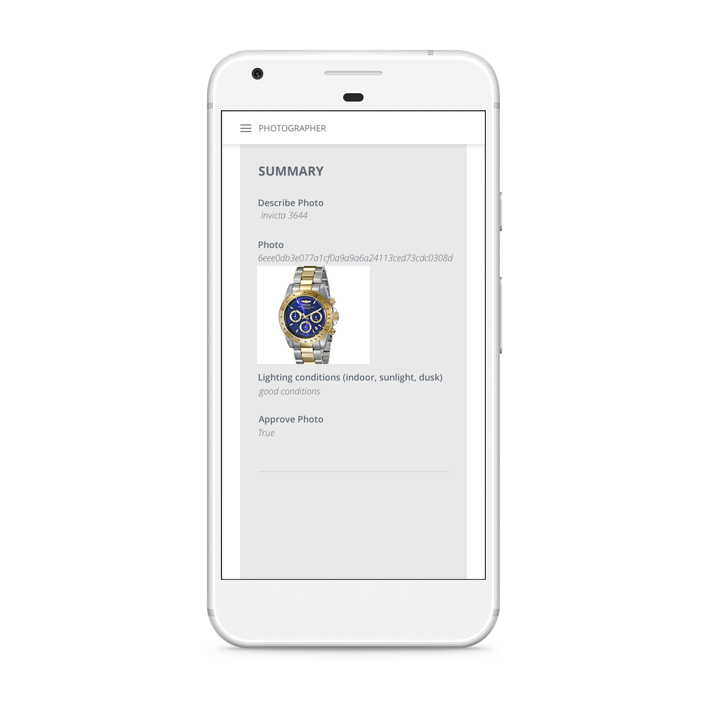
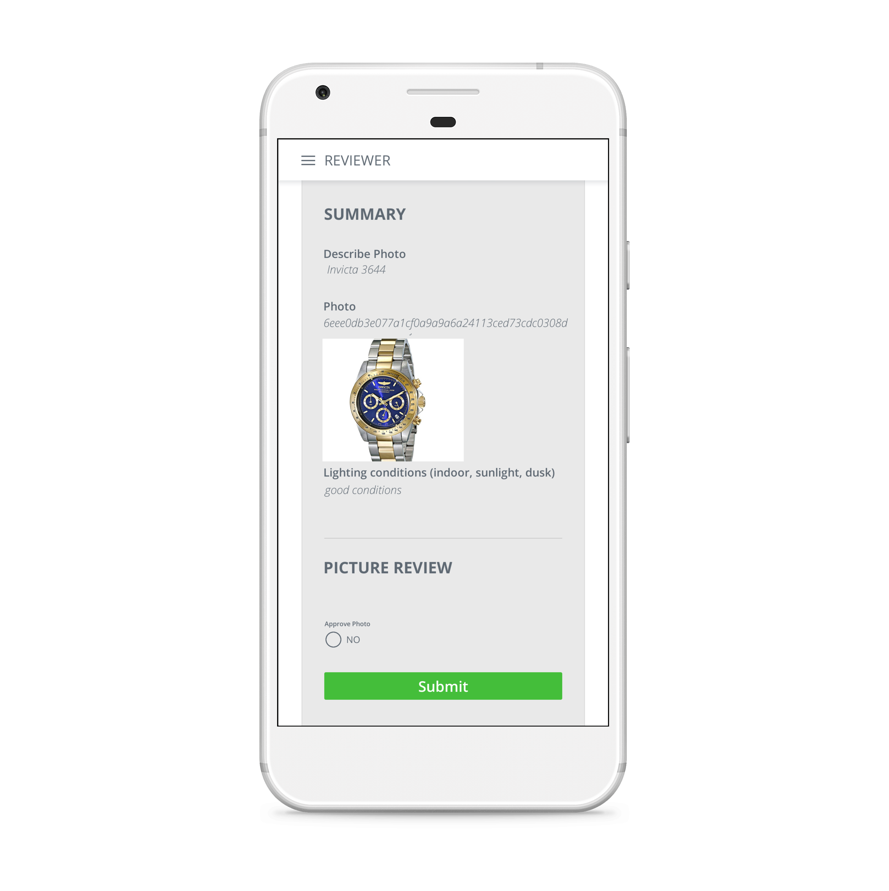

# Bitflow
*Bitcoin Dynamic Workflow Engine*

## Explanation
Rather than solving a single onboarding problem, we decided to focus on building a platform which allows for many different solutions to be built.

## Onboarding Goals
Bitflow allows administrative users with limited technical expertise to build powerful task-based workflows, where progress is recorded to Bitcoin, without needing to understand development or Bitcoin.

Bitflow allows users to earn Bitcoin for performing tasks without needing any fiat or cryptocurrency.

Bitflow workflows can collect payments and make payouts of any amount of Bitcoin at any step of the workflow.

## Features
* All progress of a workflow is recorded in Bitcoin transactions.
* Mobile task management wallet built in Unity
* Web-based workflow management tool
* Custom data handling and validation using javascript scripts stored on the blockchain
* Payment collection from customers
* Payouts to users who accomplish tasks

## Artifacts
* [Management Website](https://bitflow.shruggr.cloud)
* [Android Task Wallet](bitflow.apk)
* [Schemas](bitflow-unity/Assets/Definitions/bitflow.proto)
* [Bitcoin Protocols](docs/bitcoin-schema.md)

## Technology
* Unity wallet implemented in C# with modified NBitcoin library to allow for large OP_RETURN
* Customer and Administrative wallets implemented with Money Button
* Autonomous wallets implemented with BitIndex
* Data and web services hosted on Google Firebase
* Flow-control managed by spending UTXOs from transactions with data stored in OP_RETURN
* Transactions are submitted to API for pre-broadcast validation.
* If data requirements are not met, submission is rejected and UTXO remains unspent.
* BitIndex webhooks trigger autonomous actions
* Data validation and processing scripts are implemented as javascript, stored in OP_RETURN, and run in vm2 sandbox.
* Data schemas defined in Protobuf format for cross-platform support
* Leverage BSV large data carrier payloads - Bitflow's mobile management wallet registers photos straight from the device camera

## Details
Everything starts by defining a Workflow. A Workflow is comprised of a series of Stages where a Task is assigned to a user to collect data which fits a defined Schema. The data is validated and processed by running a Script.

There are endless possibilities for workflows: a production line, a supply chain, a list of household chores or even an Easter egg hunt. 

We've chosen to focus on two use cases to showcase Bitflow. Photo Capture and Mystery Shopper. The roles for these simplified use cases are available on the provided apk.

## Example Use-cases
### Photo Capture
An online retailer needs curated photographs of their products. Influencers receive free products in exchange for promoting and taking pictures of products. These pictures need to be curated by reviewers and later made available on the company's online catalog.

Here we have two distinct roles, Photographer and Reviewer. The Admin creates a workflow that requests:
 * The name and serial number of the product
 * A photograph of the product
 * Lighting conditions and other notes for postprocessing

The Photographer uses Bitflow's task management mobile app where a wallet address is generated, and he/she takes a photograph of the product. That transaction is submitted so a Reviewer can review the photo and details at a later time. It is not necessary for the Photographer to have funds on his address for the workflow to work.

When the Reviewer validates the photo, signs and broadcasts his transaction - potentially unbeknown to him since he may be a bitcoin layman - the Photographer receives the payout.

 {:height="36px" width="36px"}. 

The workflow admin specifies the Photographer's payout when he first created the workflow - this can be an administrative working on this online retailer company. The workflow admin is using blockchain technology without getting nitty gritty with its technical aspects or even any specific technical knowledge.

The Photographer is happy to receive his dividends in BSV.

### Mystery Shopper

